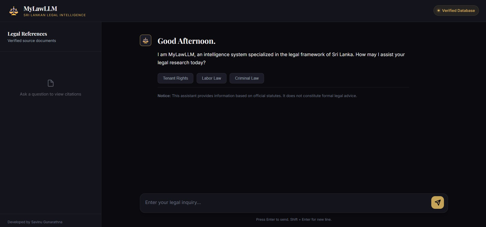
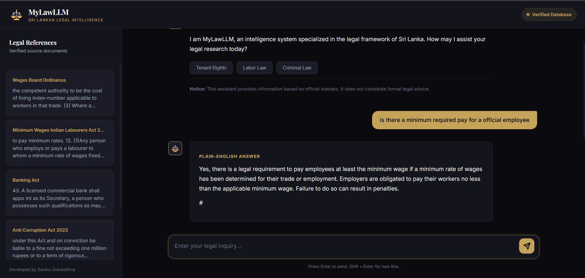
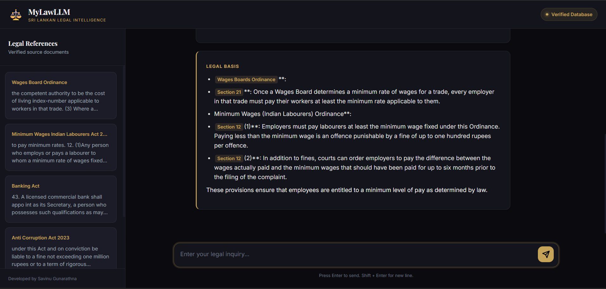

# MyLawLLM 🏛️

> A legal assistant for Sri Lankan law, built on hybrid retrieval plus LLM reasoning, so every answer stays grounded, traceable, and actually readable.

---

## overview

MyLawLLM tries to close the gap between dense legal text and something a normal person can read without a law degree. Instead of letting the model answer purely from whatever it absorbed during training, every query first pulls the relevant sections from a curated legal knowledge base. That retrieved text becomes the grounding context for the response, so the answer can be traced back to an actual Act and section rather than the model's best guess.

---

## how it works

```text
User Query
    │
    ▼
Hybrid Retrieval
    ├── Dense Search   (Embeddings / Semantic Similarity)
    └── Sparse Search  (BM25 / Keyword Relevance)
    │
    ▼
Merge & Rank Results
    │
    ▼
Top Chunks → LLM Context
    │
    ▼
Structured Response
    ├── Plain-English Explanation
    └── Legal Basis (Acts & Sections cited)
```

---

## tech stack

| Layer | Technology |
|---|---|
| Backend | FastAPI, Uvicorn |
| LLM API | OpenAI-compatible endpoint (GitHub Models / Azure) |
| Vector Database | Qdrant (Cloud-hosted) |
| Embeddings | HuggingFace `all-MiniLM-L6-v2` |
| Search | Hybrid Retrieval (Dense + BM25 via `rank-bm25`) |
| Frontend | HTML, CSS, JavaScript |

---

## why this approach

The core idea is simple: instead of asking an LLM to know the law, MyLawLLM makes it read the law first and answer from there. The result is grounded in actual statute text rather than half-remembered training data, every claim points back to a specific Act and section you can go check yourself, and the explanation is written in plain English instead of dense legal phrasing.

---

## setup

Clone the repo:

```bash
git clone https://github.com/savi664/MyLawLLM.git
cd MyLawLLM
```

Add your API keys. Create a `.env` file in the project root:

```env
OPENAI_API_KEY=your_llm_api_key_here
OPENAI_BASE_URL=your_llm_endpoint_here
QDRANT_URL=your_qdrant_cloud_url
QDRANT_API_KEY=your_qdrant_api_key
```

(adjust the variable names to match whatever your backend code actually expects)

Upload the legal PDFs to Qdrant before running the app for the first time:

```bash
uv run python SyncToQuadrant.py
```

Then start the server:

```bash
uv run uvicorn backend:app --reload
```

The app will be available at `http://127.0.0.1:8000`.

---

## screenshots

### interface


### query response

Every query returns two layers: a plain-English summary, and the underlying statutory basis with citations.

**plain-english answer**


**legal basis**
